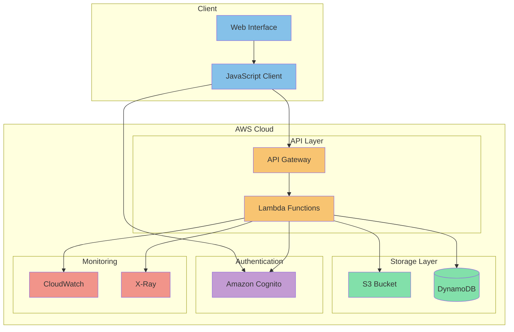

# Cloud Pioneer Architecture

This diagram illustrates the high-level architecture of the Cloud Pioneer solution. Here's a breakdown of each component:

## Client Layer
- **Web Interface**: The user-facing application built with modern web technologies
- **JavaScript Client**: Handles client-side logic and API communication

## API Layer
- **API Gateway**: Manages API endpoints and request routing
- **Lambda Functions**: Serverless functions handling business logic

## Storage Layer
- **S3 Bucket**: Stores files and static assets
- **DynamoDB**: NoSQL database for application data

## Authentication
- **Amazon Cognito**: Handles user authentication and authorization

## Monitoring
- **CloudWatch**: Monitoring and logging service
- **X-Ray**: Distributed tracing for debugging and performance analysis

The architecture follows AWS best practices for building scalable, secure, and maintainable cloud applications.
