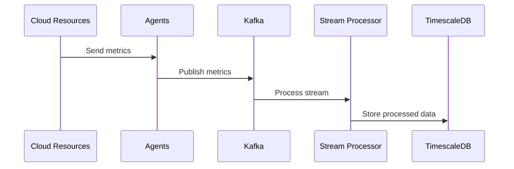
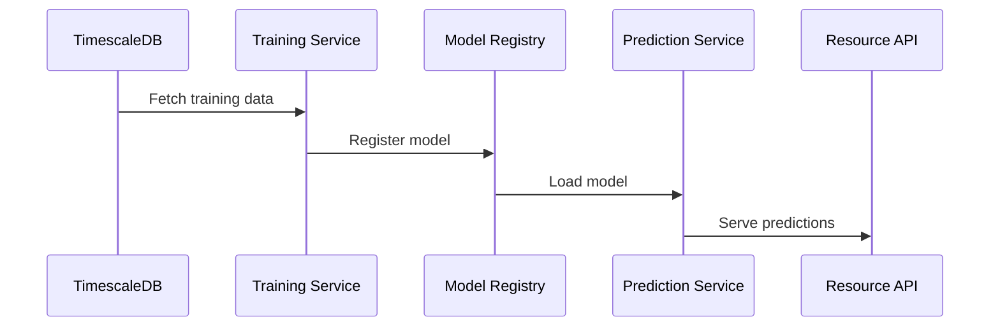
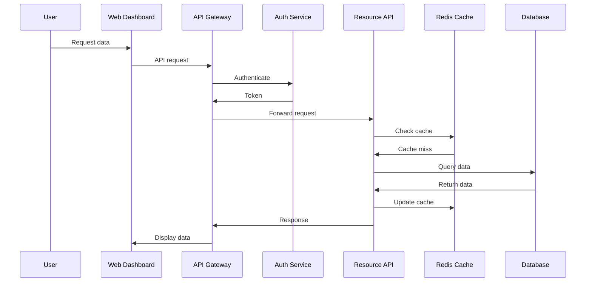
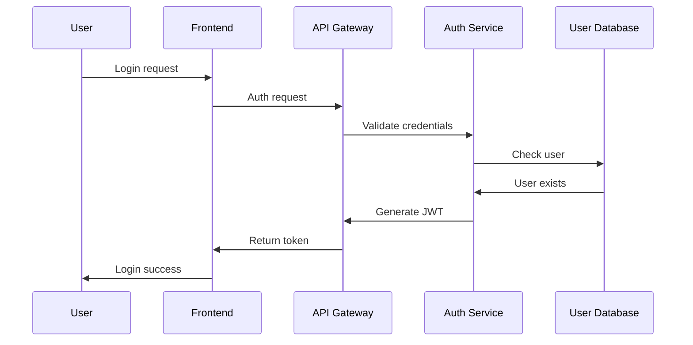
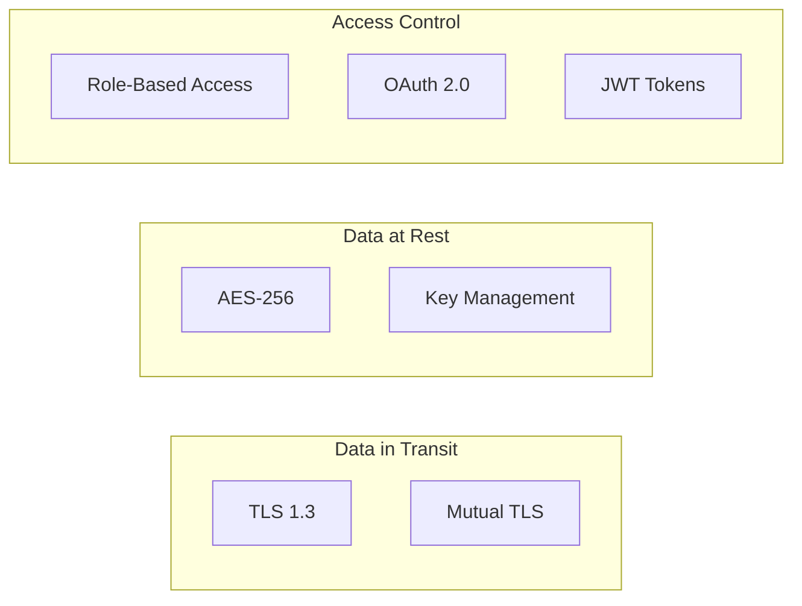
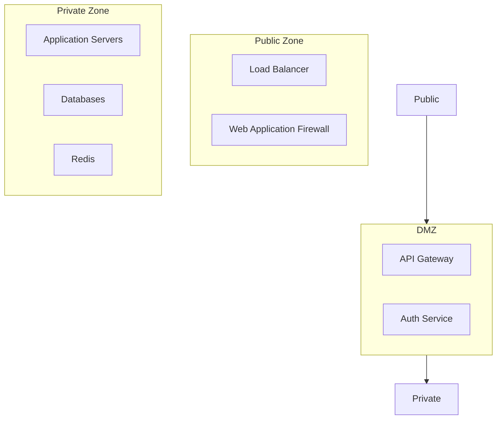
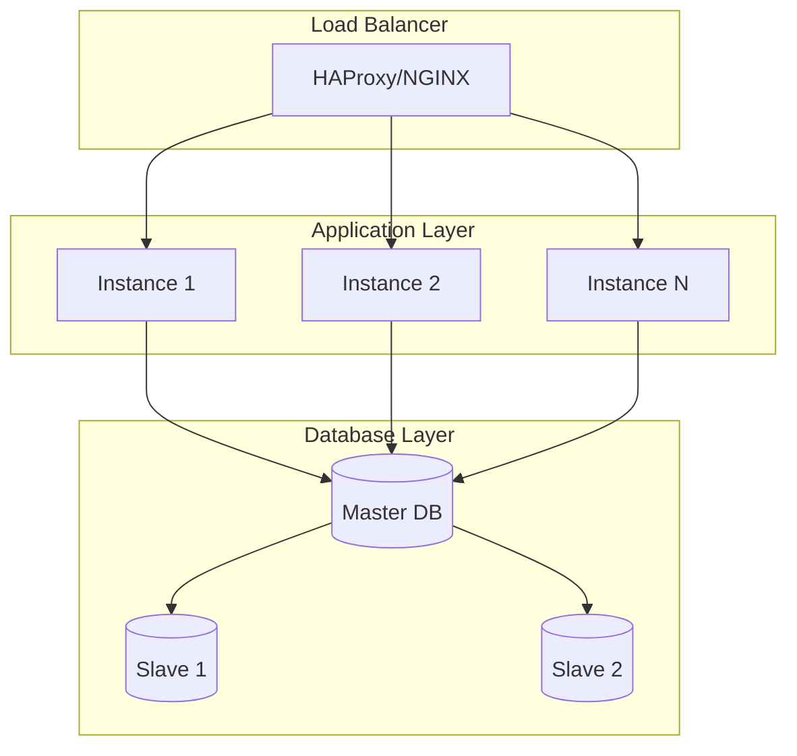
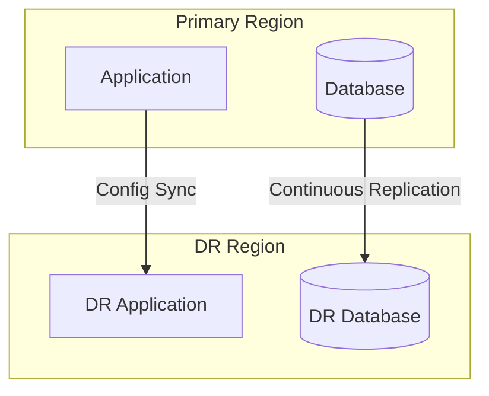

# CloudPioneer System Architecture

## Updated System Architecture

### Overview
The CloudPioneer system architecture has been enhanced to support new features and integrations, including:

- **New Cloud Agents**: Additional agents for improved resource monitoring.
- **Enhanced Data Collection Layer**: More robust metric collectors and support for additional integrations.
- **Improved Processing Layer**: Streamlined processing for better performance and scalability.

### Updated Diagram

```mermaid
graph TB
    subgraph Cloud Resources
        AWS[AWS Resources]
        GCP[GCP Resources]
        Azure[Azure Resources]
        OnPrem[On-Premises Resources]
    end

    subgraph Data Collection Layer
        Agent1[Resource Agent 1]
        Agent2[Resource Agent 2]
        Agent3[Resource Agent N]
        Collectors[Metric Collectors]
    end

    subgraph Message Queue Layer
        Kafka[Apache Kafka]
        KafkaTopics[Kafka Topics]
    end

    subgraph Processing Layer
        StreamProcessor[Stream Processor]
        BatchProcessor[Batch Processor]
        ETL[ETL Pipeline]
    end

    subgraph Storage Layer
        TimeSeries[(TimescaleDB)]
        Redis[(Redis Cache)]
        PostgreSQL[(PostgreSQL)]
    end

    subgraph ML Layer
        Training[Model Training]
        Prediction[Prediction Service]
        ModelRegistry[Model Registry]
    end

    subgraph API Layer
        APIGateway[API Gateway]
        AuthService[Auth Service]
        ResourceAPI[Resource API]
        MetricsAPI[Metrics API]
        CostAPI[Cost API]
    end

    subgraph Frontend Layer
        WebUI[Web Dashboard]
        Visualizations[Data Visualization]
        Reports[Reports Generator]
    end

    subgraph Monitoring Layer
        Prometheus[Prometheus]
        Grafana[Grafana]
        AlertManager[Alert Manager]
    end

    %% Data Collection Connections
    AWS --> Agent1
    GCP --> Agent2
    Azure --> Agent3
    OnPrem --> Agent1
    Agent1 --> Collectors
    Agent2 --> Collectors
    Agent3 --> Collectors
    Collectors --> Kafka

    %% Message Queue Connections
    Kafka --> KafkaTopics
    KafkaTopics --> StreamProcessor
    KafkaTopics --> BatchProcessor

    %% Processing Layer Connections
    StreamProcessor --> ETL
    BatchProcessor --> ETL
    ETL --> TimeSeries
    ETL --> PostgreSQL

    %% Storage Layer Connections
    TimeSeries --> Redis
    PostgreSQL --> Redis

    %% ML Layer Connections
    TimeSeries --> Training
    Training --> ModelRegistry
    ModelRegistry --> Prediction
    Prediction --> ResourceAPI

    %% API Layer Connections
    APIGateway --> AuthService
    APIGateway --> ResourceAPI
    APIGateway --> MetricsAPI
    APIGateway --> CostAPI
    ResourceAPI --> Redis
    MetricsAPI --> TimeSeries
    CostAPI --> PostgreSQL

    %% Frontend Layer Connections
    WebUI --> APIGateway
    WebUI --> Visualizations
    WebUI --> Reports
    
    %% Monitoring Connections
    Agent1 --> Prometheus
    Agent2 --> Prometheus
    Agent3 --> Prometheus
    Prometheus --> Grafana
    Prometheus --> AlertManager
    AlertManager --> WebUI

style AWS fill:#FF9900
style GCP fill:#4285F4
style Azure fill:#00A4EF
style OnPrem fill:#232F3E
style Kafka fill:#231F20
style Redis fill:#DC382D
style PostgreSQL fill:#336791
style Prometheus fill:#E6522C
style Grafana fill:#F46800
```

## System Architecture Updates

### Key Changes
- Integration of new cloud agents for improved monitoring.
- Enhanced processing capabilities with additional stream processors.
- Updated storage solutions to support increased data retention and analysis.

## Component Interactions

### 1. Data Collection Flow

### 2. ML Pipeline Flow

### 3. User Request Flow

## Component Details

### Data Collection Layer
- **Resource Agents**
  - Lightweight collectors
  - Protocol: HTTPS/gRPC
  - Authentication: mTLS
  - Rate limiting: Configurable

- **Metric Collectors**
  - Aggregation
  - Validation
  - Compression
  - Batching

### Message Queue Layer
- **Kafka Topics**
  - metrics.raw
  - metrics.processed
  - events.actions
  - events.alerts

### Processing Layer
- **Stream Processor**
  - Real-time analytics
  - Anomaly detection
  - Alert generation

- **Batch Processor**
  - Historical analysis
  - Report generation
  - Cost optimization

### Storage Layer
- **TimescaleDB**
  - Metric storage
  - Time-series analysis
  - Data retention policies

- **Redis Cache**
  - Query caching
  - Session management
  - Rate limiting

### ML Layer
- **Training Pipeline**
  - Feature engineering
  - Model selection
  - Hyperparameter tuning
  - Validation

- **Prediction Service**
  - Real-time inference
  - Batch predictions
  - A/B testing

### API Layer
- **API Gateway**
  - Authentication
  - Rate limiting
  - Request routing
  - Response caching

### Frontend Layer
- **Web Dashboard**
  - React components
  - Real-time updates
  - Interactive visualizations
  - Responsive design

### Monitoring Layer
- **Prometheus**
  - Metric collection
  - Alert rules
  - Service discovery

- **Grafana**
  - Dashboards
  - Alerting
  - Data exploration

## Security Architecture

### Authentication Flow

### Data Security

## Network Architecture

### Network Segmentation

## Scaling Architecture

### Horizontal Scaling

## Disaster Recovery

### Backup Strategy

