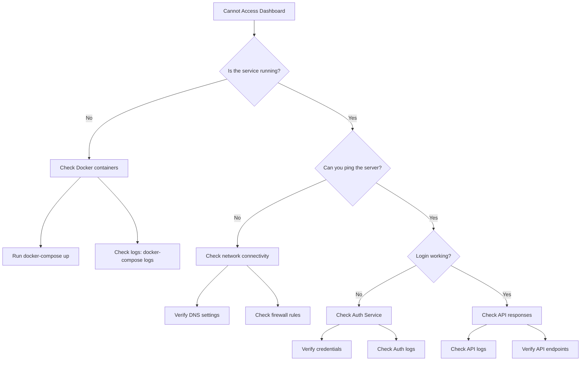
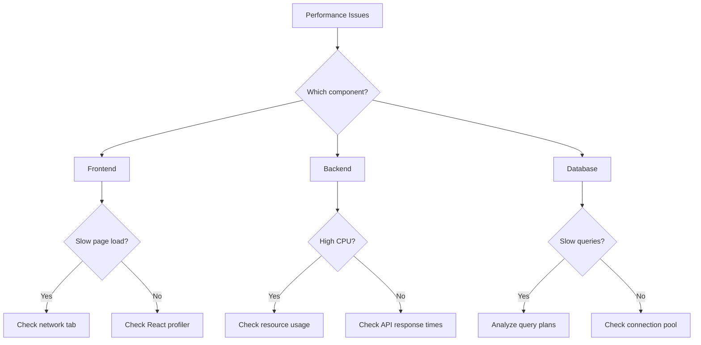
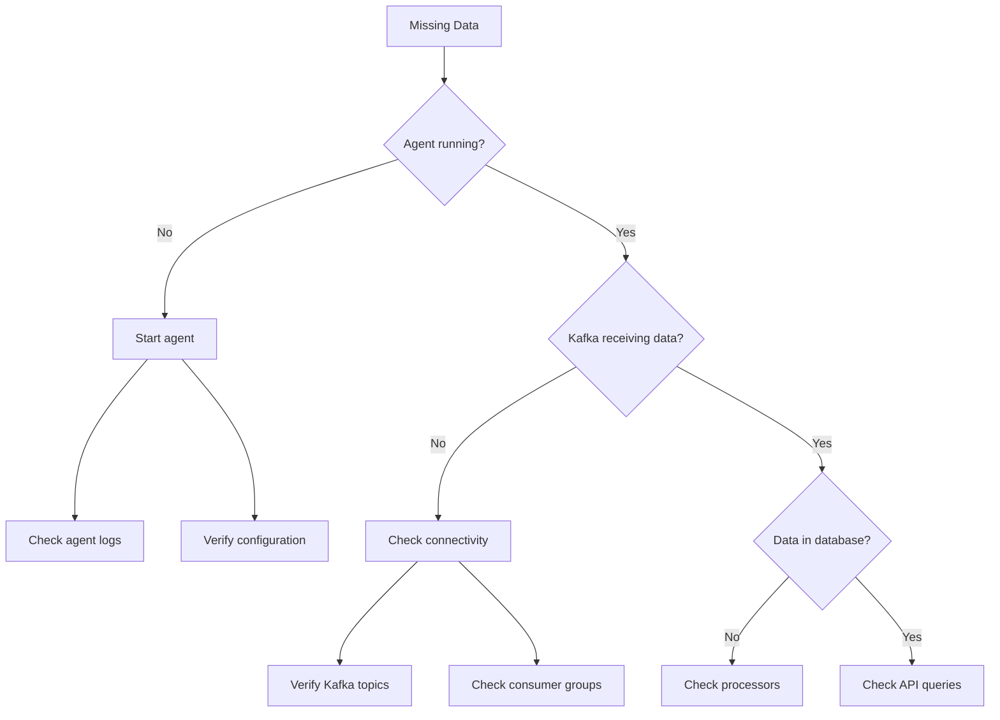
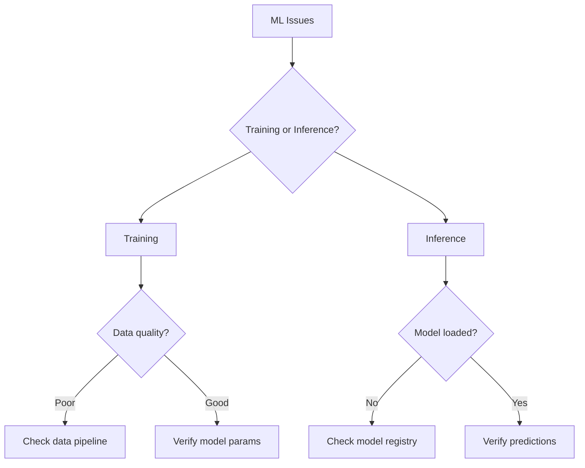
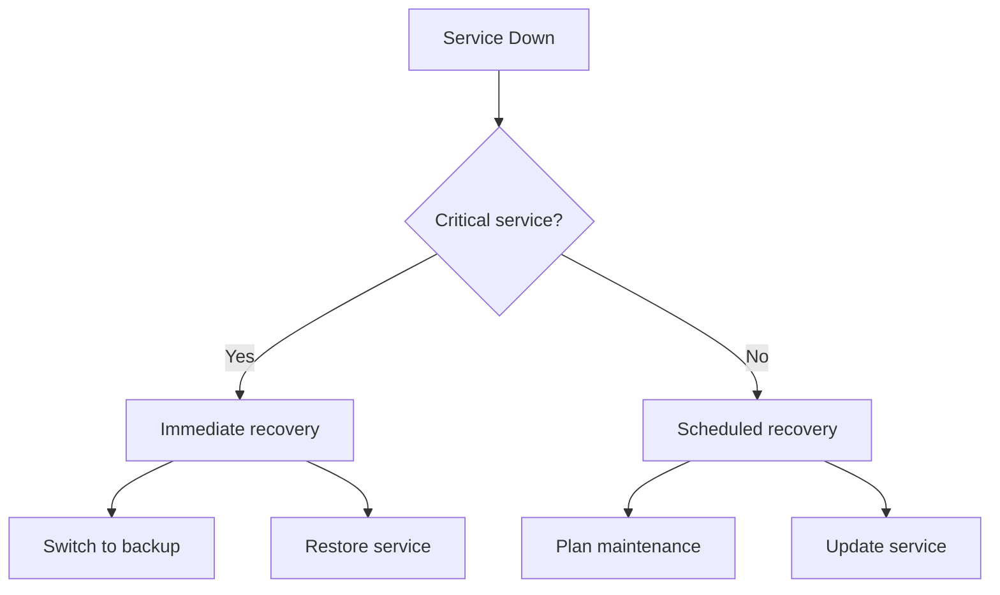
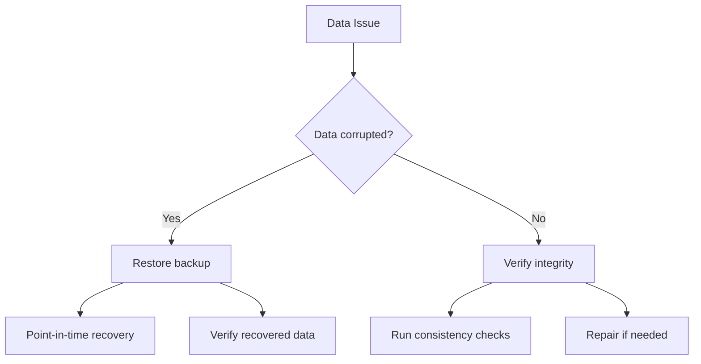
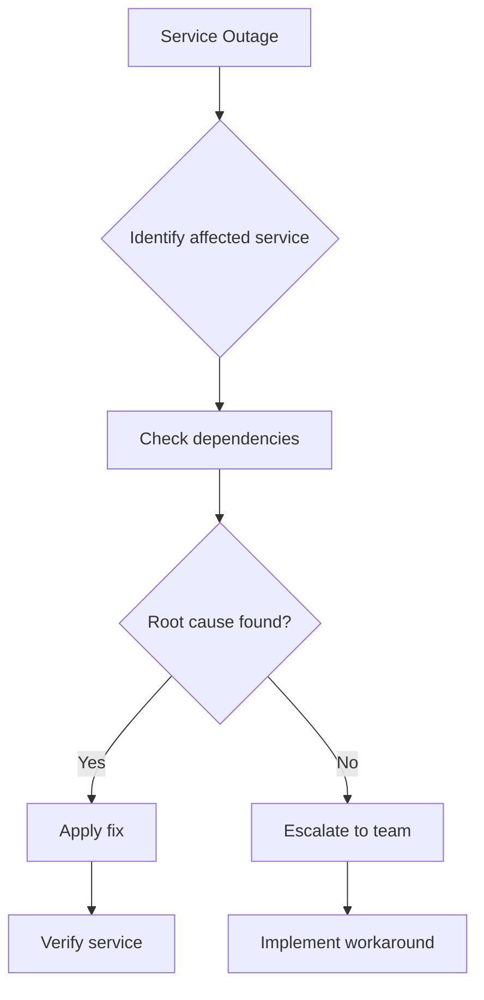
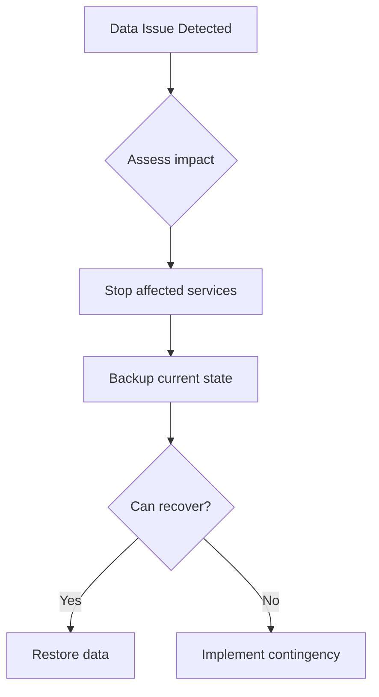

# CloudPioneer Troubleshooting Guide

## Common Issues Flowcharts

### 1. System Access Issues



### 2. Performance Issues



### 3. Data Collection Issues



### 4. ML Pipeline Issues



## Diagnostic Procedures

### 1. System Health Check

```bash
# Check all services
docker-compose ps

# Check logs
docker-compose logs -f service_name

# Check API health
curl http://localhost:8000/health

# Check database
docker-compose exec db pg_isready

# Check Kafka
docker-compose exec kafka kafka-topics.sh --list --bootstrap-server localhost:9092
```

### 2. Performance Analysis

```bash
# CPU and Memory usage
docker stats

# Database connections
SELECT count(*) FROM pg_stat_activity;

# Kafka lag
kafka-consumer-groups.sh --bootstrap-server localhost:9092 --describe --group cloudpioneer

# API response times
curl -w "@curl-format.txt" -o /dev/null -s "http://localhost:8000/api/v1/metrics"
```

### 3. Log Analysis

#### API Logs
```python
# Log patterns to look for
ERROR_PATTERNS = {
    'auth_failure': r'Authentication failed for user.*',
    'rate_limit': r'Rate limit exceeded.*',
    'db_error': r'Database connection failed.*',
    'kafka_error': r'Kafka producer error.*'
}
```

#### Agent Logs
```python
# Common agent issues
AGENT_ISSUES = {
    'connection': 'Failed to connect to server',
    'permission': 'Permission denied',
    'config': 'Invalid configuration',
    'resource': 'Resource not found'
}
```

## Recovery Procedures

### 1. Service Recovery



### 2. Data Recovery



## Monitoring Alerts

### 1. Critical Alerts

```yaml
# prometheus/alerts.yml
groups:
- name: critical_alerts
  rules:
  - alert: HighCPUUsage
    expr: cpu_usage > 90
    for: 5m
    labels:
      severity: critical
    annotations:
      description: CPU usage above 90% for 5 minutes

  - alert: HighMemoryUsage
    expr: memory_usage > 90
    for: 5m
    labels:
      severity: critical
    annotations:
      description: Memory usage above 90% for 5 minutes
```

### 2. Warning Alerts

```yaml
# prometheus/alerts.yml
groups:
- name: warning_alerts
  rules:
  - alert: HighAPILatency
    expr: http_request_duration_seconds > 1
    for: 5m
    labels:
      severity: warning
    annotations:
      description: API latency above 1 second for 5 minutes

  - alert: KafkaLag
    expr: kafka_consumer_group_lag > 1000
    for: 5m
    labels:
      severity: warning
    annotations:
      description: Kafka consumer lag above 1000 messages
```

## Quick Reference Guide

### Common Commands

```bash
# Service management
docker-compose up -d    # Start services
docker-compose down     # Stop services
docker-compose restart  # Restart services

# Log viewing
docker-compose logs -f service_name
kubectl logs pod_name

# Database
psql -U postgres -d cloudpioneer
kubectl exec -it postgres-pod -- psql -U postgres

# Kafka
kafka-topics.sh --list
kafka-console-consumer.sh --topic topic_name

# Kubernetes
kubectl get pods
kubectl describe pod pod_name
kubectl exec -it pod_name -- /bin/bash
```

### Health Checks

```bash
# API health
curl http://localhost:8000/health

# Database health
pg_isready -h localhost -p 5432

# Kafka health
kafka-topics.sh --bootstrap-server localhost:9092 --list

# Redis health
redis-cli ping
```

### Performance Checks

```bash
# System resources
top
htop
docker stats

# Network
netstat -tulpn
tcpdump -i any port 80

# Disk usage
df -h
du -sh *
```

## Emergency Procedures

### 1. Service Outage



### 2. Data Loss Prevention



## Contact Information

### Support Escalation

1. Level 1: Operations Team
   - Email: ops@cloudpioneer.com
   - Phone: +1-xxx-xxx-xxxx

2. Level 2: Engineering Team
   - Email: engineering@cloudpioneer.com
   - Phone: +1-xxx-xxx-xxxx

3. Level 3: Management
   - Email: management@cloudpioneer.com
   - Phone: +1-xxx-xxx-xxxx
